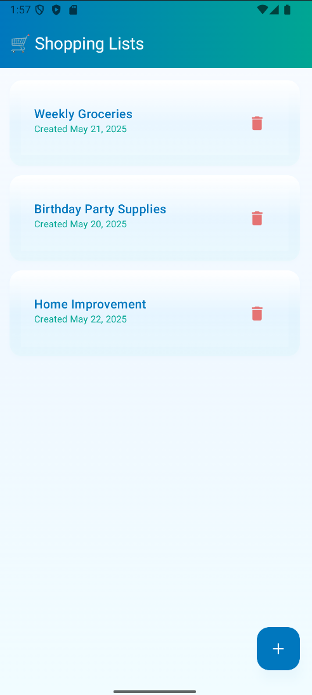
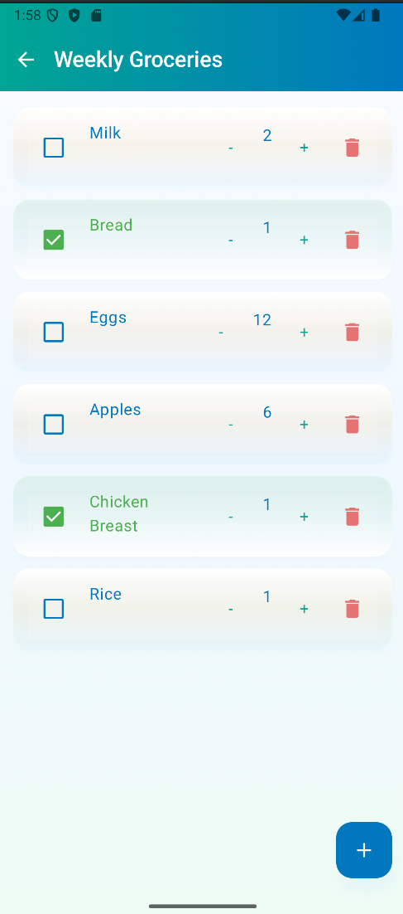
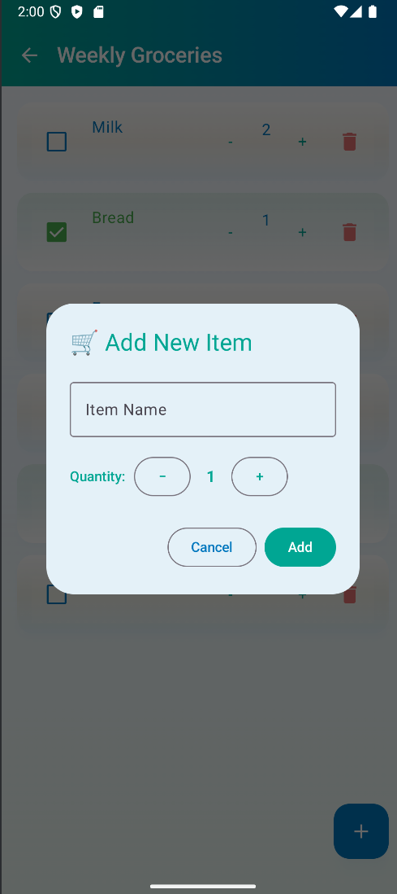

# 🛒 Shopping List App

A modern shopping list application built with **Kotlin** and **Jetpack Compose**. Create multiple shopping lists, manage items with quantities, and track your shopping progress.

## ✨ Features

- **Multiple Shopping Lists** - Create and organize different lists for various needs
- **Item Management** - Add items with custom quantities and completion status
- **Progress Tracking** - Check off items as you shop
- **Modern UI** - Clean Material 3 design with gradient themes
- **Local Storage** - Data persisted locally using Room database
- **Responsive Design** - Optimized for different screen sizes

##  Screenshots

### Home Screen
*Main dashboard showing all your shopping lists*



### Shopping List Detail
*Individual list with item management controls*



### Add New Item
*Dialog for adding items with quantity selection*



## 🛠 Tech Stack

- **Language:** Kotlin
- **UI Framework:** Jetpack Compose
- **Architecture:** MVVM (Model-View-ViewModel)
- **Database:** Room (SQLite)
- **Navigation:** Navigation Compose
- **Design:** Material 3 with custom theming

## 🏗 Project Structure

```
app/src/main/java/com/example/shoppinglistapp/
├── data/
│   ├── local/
│   │   ├── entities/          # Room entities
│   │   ├── ShoppingDatabase   # Room database
│   │   ├── ShoppingListDao    # Data access objects
│   │   └── ShoppingItemDao
│   └── repository/
│       └── ShoppingRepository # Data repository
├── ui/
│   ├── components/            # Reusable UI components
│   ├── screens/              # App screens
│   └── theme/                # Material 3 theming
├── viewmodel/                # ViewModels
├── MainActivity              # Main activity
└── Navigation               # Navigation setup
```

## 🚀 Getting Started

### Prerequisites

- Android Studio Hedgehog | 2023.1.1 or newer
- Android SDK API 24 or higher
- Kotlin 2.0.0

### Installation

1. **Clone the repository**
   ```bash
   git clone https://github.com/MariusReik/shopping-list-app.git
   cd shopping-list-app
   ```

2. **Open in Android Studio**
   - Launch Android Studio
   - Select "Open an existing project"
   - Navigate to the cloned directory

3. **Build and Run**
   - Let Android Studio sync the project
   - Click the "Run" button
   - Choose your device/emulator

## 📋 Usage

### Creating Lists
1. Launch the app to see the home screen
2. Tap the + button to create a new shopping list
3. Enter a descriptive name ("Weekly Shopping etc...")

### Managing Items
- **Add items:** Tap the + button within any list
- **Set quantities:** Use +/- buttons when adding or editing items
- **Mark complete:** Check the box next to completed items
- **Delete items:** Tap the delete icon
- **Edit quantities:** Adjust using the +/- controls on existing items

## Current Features

The app currently supports local functionality with the following capabilities:
- Multiple shopping list creation and management
- Item addition with quantity control
- Completion status tracking
- Local data persistence

## Planned Enhancements

- **Drag & Drop** - Reorder items within lists
- **List Sharing** - Share lists with family members
- **Categories** - Organize items by type
- **Smart Suggestions** - Frequently used items

## 👨‍💻 About

Built as a learning project to explore modern Android development with Jetpack Compose and Room database. 
Made by Marius Reikeraas.
